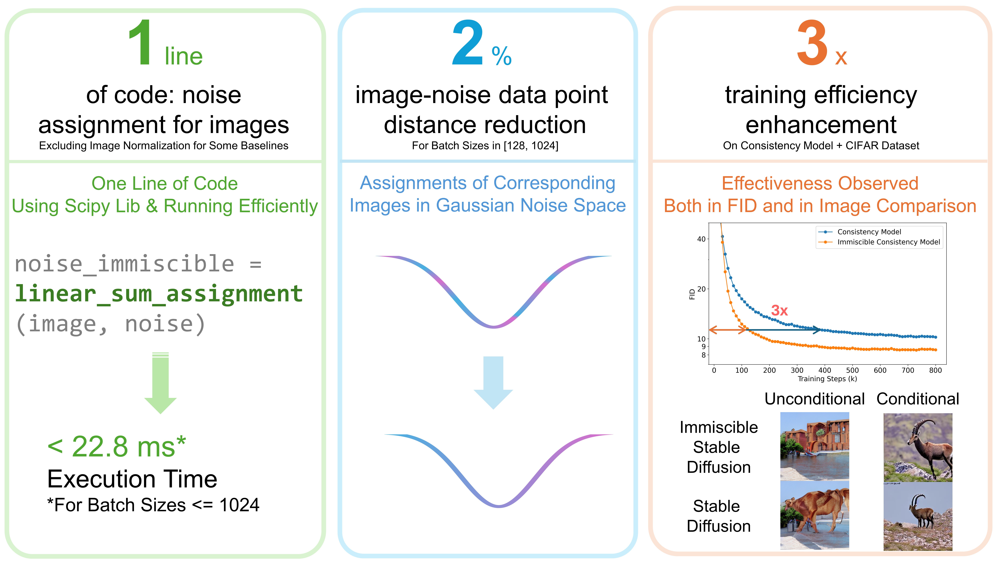

<div align="center">

# Immiscible Diffusion: Accelerating Diffusion Training with Noise Assignment
*[Yiheng Li](https://yhli123.github.io/), [Heyang Jiang](https://www.linkedin.com/in/heyang-jiang-b64a522b2/?originalSubdomain=cn), [Akio Kodaira](https://www.linkedin.com/in/akio-kodaira-1a7b98252/), [Masayoshi Tomizuka](https://msc.berkeley.edu/people/tomizuka.html), [Kurt Keutzer](https://people.eecs.berkeley.edu/~keutzer/), [Chenfeng Xu](https://www.chenfengx.com/)*

Official Github Repo for Immiscible Diffusion: Accelerating Diffusion Training with Noise Assignment
</div>

<p align="center">
    
</p>

## News!
- [2024/06/18]: Paper released on [arXiv](https://arxiv.org/abs/2406.12303).
- [2024/09/19]: Code released.
- [2024/09/26]: Paper accepted by NeurIPS 2024!

## Abstract
In this paper, we point out suboptimal noise-data mapping leads to slow training of diffusion models. During diffusion training, current methods diffuse each image across the entire noise space, resulting in a mixture of all images at every point in the noise layer. We emphasize that this random mixture of noise-data mapping complicates the optimization of the denoising function in diffusion models. Drawing inspiration from the immiscible phenomenon in physics, we propose **Immiscible Diffusion**, a simple and effective method to improve the random mixture of noise-data mapping. In physics, miscibility can vary according to various intermolecular forces. Thus, immiscibility means that the mixing of the molecular sources is distinguishable.
Inspired by this concept, we propose an assignment-then-diffusion training strategy. As one example, prior to diffusing the image data into noise, we assign diffusion target noise for the image data by minimizing the total image-noise pair distance in a mini-batch. The assignment functions analogously to external forces to expel the diffuse-able areas of images, thus mitigating the inherent difficulties in diffusion training. Our approach is remarkably simple, requiring only **one line of code** to restrict the diffuse-able area for each image while preserving the Gaussian distribution of noise. This ensures that each image is preferably projected to nearby noise. 
To address the high complexity of the assignment algorithm, we employs a quantized-assignment strategy, which significantly reduces the computational overhead to a negligible level (*e.g.,* 22.8ms for a large batch size of 1024 on an A6000). Experiments demonstrate that our method can achieve up to 3x faster training for consistency models and DDIM on the CIFAR dataset, and up to 1.3x faster on CelebA datasets for consistency models, as well as in class-conditional training and fine-tuning. Besides, we conduct thorough analysis which sheds lights on how it improves diffusion training speed while improving the fidelity.

## Repo Structure

Due to the add-on nature of immiscible diffusion, the usage guide as well as reference checkpoints are provided seperately in `README.md` of each method. We are providing following implementations:

- [x] Class-conditional Stable Diffusion [^1] training & fine-tuning & sampling
- [ ] Consistency Model (JAX version, for CIFAR only) [^2] training & sampling
- [ ] Consistency Model (PyTorch version, for other datasets) [^3] training & sampling
- [ ] DDIM [^4] training & sampling

## Maintainance and Discussion

We are open to include self-implementions from you into the official repo! To do this, please contact [Yiheng Li](mailto:yhli@berkeley.edu) or [Chenfeng Xu](mailto:xuchenfeng@berkeley.edu).

We welcome discussions and comments! Please reach out to [Yiheng Li](mailto:yhli@berkeley.edu) or [Chenfeng Xu](mailto:xuchenfeng@berkeley.edu).

## Citation
If this work is helpful for your research, please consider citing:

```
@misc{li2024immisciblediffusionacceleratingdiffusion,
      title={Immiscible Diffusion: Accelerating Diffusion Training with Noise Assignment}, 
      author={Yiheng Li and Heyang Jiang and Akio Kodaira and Masayoshi Tomizuka and Kurt Keutzer and Chenfeng Xu},
      year={2024},
      eprint={2406.12303},
      archivePrefix={arXiv},
      primaryClass={cs.CV},
      url={https://arxiv.org/abs/2406.12303}, 
}
```

## Acknowledgement

We thank numerous excellent works and open-source codebases. Specifically, we are grateful for the following repos as our implementations are based on them:

[^1]: Stable Diffusion: [diffusers/examples/text_to_image](https://github.com/huggingface/diffusers/tree/main/examples/text_to_image)

[^2]: Consistency Models (JAX version): [consistency_models_cifar10](https://github.com/openai/consistency_models_cifar10)

[^3]: Consistency Models (PyTorch version): [consistency_models](https://github.com/openai/consistency_models)

[^4]: DDIM: [ddpm-torch](https://github.com/tqch/ddpm-torch)
