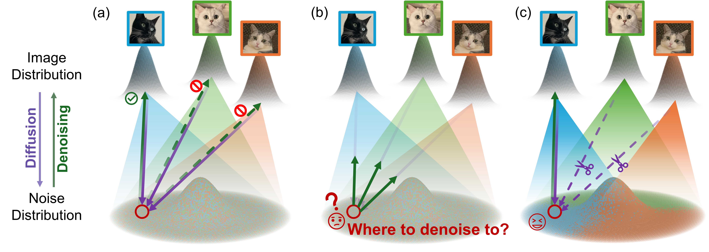

<div align="center">

# Immiscible Diffusion and Improved Immiscible Diffusion
# Accelerating Diffusion Training by Reducing Its Miscibility
*[Yiheng Li](https://yhli123.github.io/), [Heyang Jiang](https://www.linkedin.com/in/heyang-jiang-b64a522b2/?originalSubdomain=cn), [Akio Kodaira](https://www.linkedin.com/in/akio-kodaira-1a7b98252/), [Feng Liang](https://jeff-liangf.github.io/), [Dan Kondratyuk](https://hyperparticle.com/about/), [Masayoshi Tomizuka](https://msc.berkeley.edu/people/tomizuka.html), [Kurt Keutzer](https://people.eecs.berkeley.edu/~keutzer/), [Chenfeng Xu](https://www.chenfengx.com/)*

Official Github Repo for Immiscible Diffusion [NeurIPS 2024], and Improved Immiscible Diffusion: Accelerating Diffusion Training by Reducing Its Miscibility.
</div>

<p align="center">
    
</p>

## News!
- [2024/06/18]: Immiscible Diffusion Paper released on [arXiv](https://arxiv.org/abs/2406.12303).
- [2024/09/19]: Code released.
- [2024/09/26]: Paper accepted by NeurIPS 2024!
- [2025/06/01]: Improved Immiscible Diffusion Paper released on [arXiv](https://www.arxiv.org/abs/2505.18521)
- [2025/06/01]: KNN Implementations for stable diffusion and flow matching released.

## Abstract

In these papers, we point out mixing of diffusion paths from different images leads to slow training of diffusion models. During diffusion training, current methods diffuse each image across the entire noise space, resulting in a mixture of all images at a bunch of point in noisy layers. We perform step-by-step feature analysis showing that such mixture of diffusion paths complicates the optimization of the denoising functions. Drawing inspiration from the immiscible phenomenon in physics, we propose **Immiscible Diffusion**, a training strategy to reduce the mixture of diffusion paths from different images. In physics, miscibility can vary according to various intermolecular forces. Thus, immiscibility means that the mixing of the molecular sources is distinguishable. 

Inspired by this concept, we propose diverse implementations to achieve immiscible diffusion in diffusion-based models. As one example, prior to diffusing the image data into noise, we assign diffusion target noise for the image data by minimizing the total image-noise pair distance in a mini-batch. As another example, we replace the image-noise paring with a KNN noise selection process, choosing the noise point closest to the image among k Gaussian noise samples. These methods mitigate the inherent difficulties in diffusion training, and their effectivenesses are supported by detailed feature analysis. 

Our approaches are also simple, requiring only **few lines of code**, and the improved KNN implementation is pretty efficient, requiring only *0.7ms* for a large batch size of 1,024 on an A6000. Experiments demonstrate that our methods can achieve up to $>4\times$ faster training across diverse models and tasks including unconditional/conditional generation, image editing, and robotics planning. Furthermore, our analysis of immiscibility offers a novel perspective on how optimal transport (OT) enhances diffusion training. By identifying trajectory miscibility as a fundamental bottleneck, we believe this work establishes a potentially new direction for future research into high-efficiency diffusion training.

## Repo Structure

Due to the add-on nature of immiscible diffusion, the usage guide as well as reference checkpoints are provided seperately in `README.md` of each method. We are providing following implementations:

- [x] Class-conditional Stable Diffusion [^1] training & fine-tuning & sampling
- [x] Flow Matching [^3] training & sampling

## Maintainance and Discussion

We are open to include self-implementions from you into the official repo! To do this, please contact [Yiheng Li](mailto:yhli@berkeley.edu) or [Chenfeng Xu](mailto:xuchenfeng@berkeley.edu).

We welcome discussions and comments! Please reach out to [Yiheng Li](mailto:yhli@berkeley.edu) or [Chenfeng Xu](mailto:xuchenfeng@berkeley.edu).

## Citation
If this work is helpful for your research, please consider citing:

```
@inproceedings{immiscible_diffusion_neurips,
 author = {Li, Yiheng and Jiang, Heyang and Kodaira, Akio and Tomizuka, Masayoshi and Keutzer, Kurt and Xu, Chenfeng},
 booktitle = {Advances in Neural Information Processing Systems},
 editor = {A. Globerson and L. Mackey and D. Belgrave and A. Fan and U. Paquet and J. Tomczak and C. Zhang},
 pages = {90198--90225},
 publisher = {Curran Associates, Inc.},
 title = {Immiscible Diffusion: Accelerating Diffusion Training with Noise Assignment},
 url = {https://proceedings.neurips.cc/paper_files/paper/2024/file/a422a2f016c14406a01ddba731c0969a-Paper-Conference.pdf},
 volume = {37},
 year = {2024}
}

@misc{li2025improvedimmisciblediffusionaccelerate,
      title={Improved Immiscible Diffusion: Accelerate Diffusion Training by Reducing Its Miscibility}, 
      author={Yiheng Li and Feng Liang and Dan Kondratyuk and Masayoshi Tomizuka and Kurt Keutzer and Chenfeng Xu},
      year={2025},
      eprint={2505.18521},
      archivePrefix={arXiv},
      primaryClass={cs.CV},
      url={https://arxiv.org/abs/2505.18521}, 
}
```

## Acknowledgement

We thank numerous excellent works and open-source codebases. Specifically, we are grateful for the following repos as our implementations are based on them:

[^1]: Stable Diffusion: [diffusers/examples/text_to_image](https://github.com/huggingface/diffusers/tree/main/examples/text_to_image)

[^2]: DDIM: [ddpm-torch](https://github.com/tqch/ddpm-torch)

[^3]: Flow Matching: [conditional-flow-matching](https://github.com/atong01/conditional-flow-matching)